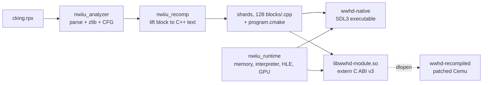

# Repository Guidelines

Conventions and hard-won facts for nWiiURecomp. Read before changing the
recompiler, the runtime, or the Cemu-derived port.

## Project Overview

nWiiURecomp statically recompiles Nintendo Wii U executables (`.rpx`/`.rpl`)
into native code backed by a checked Cafe OS runtime. The only *validated*
target is *The Legend of Zelda: The Wind Waker HD* EU v0 (`WUP-P-BCZP`, title
version 0), but it is no longer compiled in: per-game facts live in `.toml`
profiles under `configs/`, passed with `--config`. See "Game profiles" below.

Two consumers share one lifter:

- **`wwhd-native`** — standalone SDL3 runner with the in-tree GX2/Latte renderer.
- **`wwhd-recompiled`** — a patched Cemu that `dlopen`s `libwwhd-module.so` and
  dispatches guest PPC blocks to it, falling back to its own JIT/interpreter.
  This is the one that actually plays the game.

Branch note: this document describes `feature/shader-extractor`. The LLVM-IR
backend, region formation, and the shader AOT table live on
`feature/wwhd-direct-llvm-backend` (the trunk, 571 commits). **There is no LLVM
or `llc` dependency on this branch** — the generator emits C++ source text.

## Architecture & Data Flow



Library dependency is strictly one-way: `nwiiu_recomp` → `nwiiu_runtime` →
`nwiiu_analyzer`. **None of the three link Cemu.** The port is a parallel build
that meets the generated code only at the `extern "C"` seam in
`nWiiURecomp/include/nwiiu/static_module.h` (ABI version 3).

Lifting emits per-instruction C++ calling the runtime's header-inline PPC
semantics (`runtime/ppc_semantics_inl.h`), so the host compiler does the real
optimisation. `project_generator.cpp:499` writes the shards, a registry, a
`main.cpp`, a `module.cpp` and a `program.cmake`, replacing the output directory
atomically with rollback (`:471-497`).

At runtime the port hands the module a **flat mapping** of the guest address
space (`nwiiu_static_memory::flat_base`) rather than per-access callbacks:
2.75 ns → 0.74 ns per access. A host that cannot map the full 32-bit range
leaves `flat_base` null and the callbacks still work.

## Key Directories

| path | purpose |
| --- | --- |
| `nWiiUAnalyzer/` | RPX/RPL parse, relocation, function + basic-block recovery, JSON manifest. Namespace `nwiiu::analyzer`. |
| `nWiiURecomp/` | The lifter (`native_generator.cpp`), project emitter, both CLIs, and the GPU7 shader extractor. Namespace `nwiiu::recomp`. |
| `nWiiURuntime/` | Guest memory, Espresso interpreter, scheduler, Cafe OS HLE, GX2/Latte/AddrLib, SDL3 renderer. Namespace `nwii::runtime` — note the missing trailing `u`. |
| `configs/` | Per-game profiles. `wwhd-eu-v0.toml` is the pinned target; `generic.toml` authenticates nothing and is the starting point for a new game. |
| `nWiiUAnalyzer/Ghidra/` | `ExportWiiUProfile.java` — emits a profile plus a `Name,Start,End,Size` symbol CSV from an analysed RPX. |
| `nWiiUStudio/` | GUI, sources imported from NWiiRecomp. **Does not build**: `StudioState.hpp` includes NWii headers (`loader/loader.h`, `recompiler/recompiler.h`, `toml++`) that do not exist here. Gated behind `-DNWIIU_BUILD_STUDIO=ON`, OFF by default. |
| `extern/Cemu/` | Vendored submodule, pinned + patched. See the patch workflow below. |
| `tools/` | Three bash scripts, no Python. |
| `patches/cemu/` | The entire port as one tracked git diff. |
| `media/` | Logos plus `wwhd-port.rc` / `wwhd-port-icon.*`, consumed as `NWIIU_PORT_ASSET_DIR`. |

Dead code that looks alive: `nWiiURuntime/src/main.cpp` and
`nWiiURuntime/src/hle/` are absent from the CMake source lists.

## Development Commands

```bash
# Host libs, CLIs and the 36 unit tests. ~15 s including the nested-configure test.
cmake -S . -B build -DCMAKE_BUILD_TYPE=Release
cmake --build build -j8
ctest --test-dir build --output-on-failure

# Analyze an RPX into a deterministic manifest. Exit 3 is NORMAL (unresolved
# control-flow records remain); 2 is a usage error; 0 means none remain.
# Without --config the built-in WWHD profile applies; --any-title drops the gates.
./build/nWiiUAnalyzer/nwiiu-analyze --config configs/wwhd-eu-v0.toml \
  /path/to/code/cking.rpx build/wwhd-eu-v0.json

# Headless interpreter-only runner. 0 = guest_exit, 2 = usage, 3 = structured stop.
# --list-hooks prints every name a profile's [hle_hooks] may use.
./build/nWiiURecomp/nwiiu-run /path/to/code/cking.rpx \
  --config configs/wwhd-eu-v0.toml \
  --max-instructions 50000000 --save-root /tmp/wwhd-recomp-save --trace

# Full windowed port. Argument MUST be absolute and contain code/cking.rpx. ~25 min.
tools/build-wwhd-port.sh /absolute/path/to/WWHD

# Cemu patch lifecycle. Run the export after ANY edit under extern/Cemu/src.
tools/export-cemu-patch.sh    # regenerate + round-trip verify the patch
tools/prepare-cemu.sh         # verify pin, init submodules, apply the patch
```

**Budget for the 25 minutes.** Any change to the generator, to `nWiiURuntime`
headers, or to `patches/cemu/` forces a full module rebuild (479k blocks,
~20 min of the 25). Batch several hypotheses per rebuild.

There is no linter and no CI. `-Wall -Wextra -Wpedantic -Werror` on GNU/Clang is
the gate, applied per target — but **not** to `nWiiUAnalyzer`/`nWiiURuntime`
test targets, so warnings there will not fail a build.

## Game profiles

Nothing in the tree names a title. A profile (`nwiiu::analyzer::GameConfig`,
`game_config.h`) carries the target gates, the HLE hook table, and the names the
generator gives its CMake targets. The format is the one NWiiRecomp uses, read
by a hand-rolled TOML subset parser in `game_config.cpp` — comments, `[table]`
headers, `key = value` with basic strings, decimal/`0x` integers and booleans.
No arrays, no inline tables, and no external dependency.

- **Both gates are optional.** An empty `sha256` authenticates nothing; a zero
  `entry_point` adopts the image's own. The RPX header checks still apply, so a
  corrupt image is rejected either way (`rpx.cpp:110-117`).
- **Hooks are named, not addressed.** `[hle_hooks]` maps a guest address to a
  routine in `native_hooks.cpp`; the routine is portable, the address is not.
  An unknown name throws from `Machine`'s constructor — the alternative is a
  hook that never fires and costs a rebuild to notice.
- **`target_prefix` names the generated targets.** WWHD pins it to `wwhd`
  because `tools/build-wwhd-port.sh` and the Cemu patch look for
  `libwwhd-module.so`. Root `CMakeLists.txt` checks
  `${NWIIU_GENERATED_PREFIX}-native`, defaulting to `wwhd`.
- **The generated program never reads the .toml.** `project_generator.cpp`
  bakes the profile into `main.cpp` (`profile_target()`, `profile_hooks()`) and
  the title id into `module.cpp`.
- **Three copies of the WWHD table exist** and must stay in step:
  `configs/wwhd-eu-v0.toml`, `nwii::runtime::default_hle_hooks()`, and
  `nwiiu::recomp::builtin_profile()`. The last two are what a `--config`-less
  invocation gets, which is why behaviour is unchanged without a profile.
- `.gitignore` ignores `*.toml` with a `!configs/*.toml` exception. A profile
  written anywhere else is silently untracked.

## Code Conventions & Common Patterns

- **C++20**, no compiler extensions (`CMAKE_CXX_EXTENSIONS OFF`). `std::span`
  and defaulted `operator<=>` are used; no concepts, no `[[gnu::weak]]`. The
  only linker seam is `extern "C"`.
- **Naming:** `snake_case` functions and files, `PascalCase` types,
  `kCamelCase` constants (`kBlocksPerShard`, `kWwhdEuV0`), `g_` for the few
  globals (`g_patch_lo`). Headers under `include/<component>/`, one per `.cpp`.
- **Error handling is split by trust boundary.** Untrusted input (RPX, shader
  containers, guest buffers) uses bounds-checked readers returning `bool` —
  `try_rd_be32(span, offset, out)` in `shader_types.h:65`. Programmer errors and
  unreachable translation cases throw. CLIs catch at `main` and map to exit
  codes; the port never throws across the module ABI, it returns
  `NWIIU_STATIC_RESULT_{MISS,EXECUTED,FAULT}`.
- **Diagnostics are opt-in env checks written inline**, with an ALL-CAPS tag:
  `if (std::getenv("NWIIU_POOL_TRACE")) fprintf(stderr, "POOL key=%08X ...")`.
  On hot paths hoist the lookup into a `static const`
  (`PPCStaticRecompiler.cpp:487`).
- **Fail fast at configure time**, not build time: `message(FATAL_ERROR ...)`
  for a non-absolute `NWIIU_GENERATED_PROGRAM`, a missing `program.cmake`, or a
  missing `wwhd-native` target (root `CMakeLists.txt:18-32`).
- **Comments state the bug being guarded, or cite ground truth**, never restate
  the code: *"Ground truth captured against the real decaf-emu/addrlib
  (gbAddrConfig 0x44902, chip R7XX)"* — `latte_surface_test.cpp:77`.
- **Shell:** `#!/usr/bin/env bash`, `set -euo pipefail`, `trap cleanup EXIT`,
  usage embedded in the parameter expansion:
  `game=${1:?usage: tools/build-wwhd-port.sh /absolute/path/to/WWHD}`.
- **Commits:** lowercase `type: imperative summary`, where type is `recomp:`,
  `port:`, `perf:`, `docs:`, `fix:`. Branches: `feature/<topic>`,
  `pr/NN-topic`.
- **Never commit** game files, dumps, generated manifests (`wwhd-manifest.json`),
  traces, runner output, `*.ppm`, `*.rpx`, or anything under `build*/`.
  `.gitignore` also swallows `docs/`, `.*/`, and `*.txt` except `CMakeLists.txt`,
  so a new plain-text doc is silently untracked.

## Important Files

| file | why it matters |
| --- | --- |
| `nWiiURecomp/include/nwiiu/static_module.h` | The C ABI between generated code and both hosts. ABI v3. Changing it means rebuilding everything. |
| `nWiiURecomp/src/project_generator.cpp` | Emission pipeline; `program.cmake` template at `:421-442`, generated `main()` at `:232`. |
| `nWiiURecomp/src/native_generator.cpp` | PowerPC → C++ text, per instruction. 1147 lines; the golden-fixture test guards it. |
| `nWiiURuntime/include/runtime/ppc_semantics_inl.h` | Inline by design. Editing it triggers the 25-minute rebuild. |
| `nWiiURuntime/include/runtime/wwhd_renderer.h` | Header-only SDL3/Vulkan renderer; source of most `NWIIU_GPU_*` knobs. |
| `nWiiURuntime/src/patch_guard.cpp` | Refuses blocks overlapping host-patched addresses. The `[lo, hi)` bracket is one load-and-compare on the fast path. |
| `patches/cemu/0001-wwhd-recompiled-port.patch` | The entire port, ~30 files, incl. `PPCStaticRecompiler.*` and `PortMode.*`. |
| `nWiiUAnalyzer/tests/test_support.h` | The only test helper in the repo. |
| `tools/build-wwhd-port.sh` | The only supported way to build the port. |

## Runtime/Tooling Preferences

- CMake ≥ 3.20, a C++20 GCC or Clang. No compiler is pinned.
- System deps: OpenSSL ≥ 3.0 (Crypto), ZLIB, **shaderc via pkg-config**
  (`nWiiURuntime/CMakeLists.txt:1-2`, `REQUIRED` — configure fails outright
  without it), SDL3 ≥ 3.2 for the generated program.
- Port host deps: `wayland-protocols` (Wayland is the default) and `zip`
  (optional but strongly wanted — without it vcpkg cannot populate its binary
  cache and every rebuild recompiles the dependency tree from source).
- vcpkg belongs to the Cemu submodule; there is no root `vcpkg.json`.
- **`extern/Cemu` is a patched submodule, not a checkout.** The worktree is the
  pinned commit `b8f2cf4b` plus the tracked patch.
  - ` M extern/Cemu` in `git status` is the normal, expected state.
  - Edit `extern/Cemu/src/...` freely, then run `tools/export-cemu-patch.sh`
    *before* building, or the build aborts with `Cemu has changes not described
    by the tracked patch`.
  - `git -C extern/Cemu checkout -- <file>` reverts to **upstream Cemu** and
    destroys port work on that file. Full reset:
    `git -C extern/Cemu checkout -- . && git -C extern/Cemu clean -fdq src && tools/prepare-cemu.sh`
    — the `clean` is required because the patch adds untracked files.
  - Bumping the pin means editing the hash in **two** scripts
    (`prepare-cemu.sh:8`, `export-cemu-patch.sh:8`).
- The repo path contains a space, so the port build works through a
  `/tmp/wwhd-recompiled-$UID-<cksum>` symlink (vcpkg breaks on the space). Do
  not `cmake --build build-wwhd-port/cemu` directly once that alias is gone.
- Env knobs worth knowing (full lists are in `PPCStaticRecompiler.cpp` and
  `wwhd_renderer.h`):

  | variable | effect |
  | --- | --- |
  | `NWIIU_HOST_JIT=1` | re-enable Cemu's recompiler. **Off by default** — the sense is inverted from the name. |
  | `NWIIU_STATIC_DISABLE=1` | disable the static module entirely (the control for throughput experiments) |
  | `NWIIU_DIFF=1` | differential-test every block against the interpreter |
  | `NWIIU_DISABLE_LO`/`_HI` | defer blocks in a range — bisect a bad block without a 25-minute rebuild |
  | `NWIIU_ONLY_LO`/`_HI` | the inverse: defer everything outside the range |
  | `NWIIU_AUTOSHOT=<dir>` | dump presented frames from the renderer, not the desktop |
  | `NWIIU_BUDGET_SLACK=<n>` | instructions a block may overshoot the quantum by (default 2048) |
  | `NWIIU_MISS_DUMP=<path>` | write the dispatch-miss table |

## Testing & QA

**No framework.** 36 first-party CTest targets (plus `wwhd_port_test`, which
exists only in the port build), all on a hand-rolled harness:
`test::require(bool, std::string_view)` in `nWiiUAnalyzer/tests/test_support.h:20`
prints `FAIL: <message>` and `std::exit(1)`. Every test is a plain executable
whose `main()` calls `void test_<behaviour_sentence>()` in sequence. There is no
isolation and no teardown beyond `test::TempDir` RAII.

```bash
ctest --test-dir build --output-on-failure    # --test-dir is mandatory
ctest --test-dir build -R '^shader_' -j8      # by name
ctest --test-dir build -N                     # list without running
./build/nWiiURuntime/executor_test            # or run the binary directly
```

Adding a test: drop `<subject>_test.cpp` in `<component>/tests/`, then
`add_nwiiu_test(name src)` (analyzer) or `add_shader_test(name src)` (recomp).
`nWiiURuntime` has no helper — copy the four-line
`add_executable`/`target_link_libraries`/`target_include_directories`/`add_test`
block. Fixtures are synthesized in memory (`test::build_test_rpx()`), never
checked in as binaries.

Traps:

- **`native_test` is a golden-source test** against
  `tests/generated/native_fixture.cpp`. Any generator change breaks it; the fix
  is to regenerate the checked-in fixture, never to loosen the assertion. Same
  shape for `manifest_test` against the JSON schema.
- **`recompile_cli_test` shells out to a full nested CMake configure** of the
  whole tree, and fails wherever the deps are not discoverable. It used to be
  unrunnable because that configure pulled Studio's six FetchContent clones;
  with Studio gated off it is ~7 s.
- **`shader_corpus_gate_test` self-skips** unless `NWIIU_WWHD_CONTENT` points at
  real game content. A green suite does not mean it ran. No other test needs a
  dump, a GPU, or the network.
- **`wwhd_port_test` is invisible** from `build/` — it only exists after the
  25-minute port build, at `ctest --test-dir build-wwhd-port/cemu`. It uses bare
  `assert`, so a Release build makes it vacuous.
- **Failure output names the invariant, not the test** — no file, no line. Grep
  the message string; duplicate messages across files are a real hazard.

### Verifying a port change

Unit tests do not cover rendering. Rendering is the acceptance test.

```bash
d=$(mktemp -d)
NWIIU_AUTOSHOT=$d timeout 90 ./wwhd-recompiled -f --verbose > /tmp/run.log 2>&1 &
sleep 5; /tmp/vpad2 80 &        # virtual pad, presses A/Start past menus
```

Then, in order: count `$d/*.ppm`; check `grep "nWiiU draws:" /tmp/run.log | tail -1`
is ~100k+ per 120 frames (a flat `+2280` is a blank screen with a healthy
present loop, which looks like success if you only count frames);
`grep -icE "fault at|terminate|Segmentation"` must be 0; then convert a late
frame and **look at it**. Frames alone prove nothing.

`NWIIU_DIFF=1` is the correctness authority — it shadows each block's stores,
rewinds, replays the same instruction count on Cemu's interpreter, and compares
GPRs, FPRs, LR, CTR, CR, XER, FPSCR, the reservation and memory. ~155M
comparisons per run, currently zero divergences. Both sides must run *inside the
same process*; the emulation is not deterministic run to run. Diff mode is too
slow to render, so it never validates rendering.

### Measuring coverage

This has produced wrong headline numbers twice. There are **three** engines: the
static module, Cemu's JIT, and Cemu's interpreter.

- A *dispatch* is one entry that found a block. A one-word HLE stub and a
  1,469-instruction block score identically. **Dispatch rate is not coverage.**
- Quote `native / (native + JIT + interp)` from the `nWiiU instr:` log line,
  cross-checked against quantum accounting (slices × 45,000).
- The share decays over a run as Cemu's JIT warms. Quote steady state from a
  long run, not the first line.

### Already ruled out

Do not re-litigate without new evidence; each cost hours.

- **Guest speed / pacing.** Both slower and faster than the working config fail.
  Pure interpretation with the module disabled fails identically — the control
  proving the failure is throughput, not recompilation.
- **Scheduler fairness.** Round-robin breaks the title even with the module off.
  Cafe OS is strict priority; a spinning thread starving lower-priority threads
  on its core is correct behaviour.
- **Instruction-cache pressure.** A loop small enough to sit in cache runs no
  faster than the whole game.
- **Module correctness.** See the differential tester.
