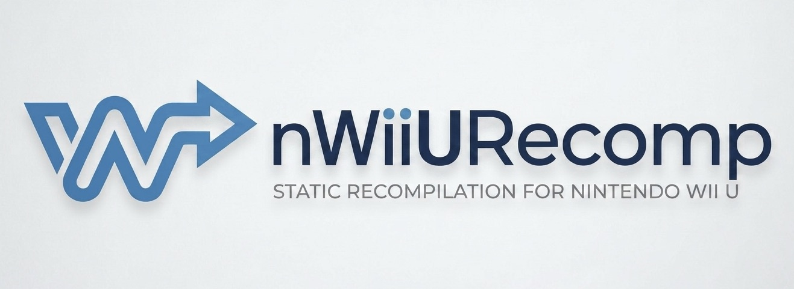

<p align="center">
  
</p>

<p align="center">
  Static recompilation and runtime toolkit for Nintendo Wii U executables.
</p>

<p align="center">
(The first recompiler that really works)
</p>

<p align="center">
  <a href="https://discord.gg/wp7zdxyqT">
    
  </a>
  <br><br>
  <a href="https://youtube.com/@blacklineinteractive">
    
  </a>
</p>

---

## What is this?

nWiiURecomp translates Nintendo Wii U (`.rpx`, `.rpl`) executables into native C++ code backed by a Cafe OS runtime. The output is a standalone executable that runs natively without instruction-level emulation. Hardware interactions are handled by a High-Level Emulation (HLE) runtime layer.

> **Note on Our Approach:** Unlike some recompilation projects that rely heavily on shader generation or existing emulator pipelines, nWiiURecomp translates the original PowerPC machine code statically and builds upon a customized, checked Cafe OS runtime to provide the native execution environment.

> **Latest Update:** The current milestone authenticates the Wind Waker HD EU v0 executable, maps its sections and relocations, initializes Cafe ABI state, and runs deterministically through cooperative startup. The static recompiler is achieving near-native speeds natively alongside a standalone headless runner or Cemu-derived windowed host.
> 
> **Note on Universality:** The target is no longer compiled in. Every per-game fact — which build to authenticate, which routines to serve natively, what the generated project is called — lives in a `.toml` profile under [`configs/`](configs/), passed with `--config`. WWHD remains the one *validated* title; adding another game is a new profile, not a patch to the tree.

---

## Project Structure

```
nWiiURecomp/
├── configs/         — Per-game profiles (.toml): the only place a title is named
├── nWiiUAnalyzer/   — RPX/RPL parser and function boundary analyzer
│   └── Ghidra/      — ExportWiiUProfile.java: generates a profile + symbol CSV
├── nWiiURecomp/     — Offline static recompiler (PPC → C++)
├── nWiiURuntime/    — Checked Cafe runtime foundation
└── nWiiUStudio/     — GUI debugging and inspection tool (Raylib + ImGui)
```

---

## What Works

### Analyzer (`nWiiUAnalyzer`)

- Validates executable fingerprint.
- Writes a deterministic JSON manifest containing control-flow records and basic blocks.
- Currently authenticates WWHD EU v0, but the architecture is designed to scale universally.

### Recompiler (`nWiiURecomp`)

- Translates PowerPC instructions to C++ source text per instruction.
- Generates a standalone C++ project (`program.cmake`) wrapping up the generated `shard` files.
- Generates a module ready for compilation via the native host toolchain.

### Runtime (`nWiiURuntime`)

- **Interpreter fallback**: Contains an Espresso interpreter for sections not statically compiled or for testing purposes.
- **Hardware & Memory**: Maps guest sections, loader-backed data imports, mounts Cafe content/save storage.
- **HLE (High-Level Emulation)**: Recompilation stops and seamlessly calls host implementations for Cafe OS APIs.
- **Windowed Port**: Dispatches guest PPC blocks natively through `libwwhd-module.so`, achieving significantly lower latency per access compared to traditional callbacks. 

### Studio (`nWiiUStudio`)

- GUI debugging and inspection tool via Raylib and ImGui.
- Assists in inspecting memory, assembly, and recompilation metadata.

---

> **A Note on Development:** To ensure maximum code quality and preserve the integrity of the architecture, AI is used **exclusively** for generating commit message titles and translating code comments to English—nothing more. All core reverse-engineering, recompilation logic, and architectural design are entirely human-driven.

---

## Building

**Requirements:** CMake 3.20+, a C++20 compiler, OpenSSL 3.0, ZLIB, shaderc, and SDL3. Wayland protocols and zip are highly recommended for Linux/host environments.

```bash
# Build host libs, CLIs and unit tests.
cmake -S . -B build -DCMAKE_BUILD_TYPE=Release
cmake --build build -j8
ctest --test-dir build --output-on-failure
```

`nWiiUStudio` is off by default (`-DNWIIU_BUILD_STUDIO=ON` to include it): it
clones six projects at configure time, so building it needs the network.

---

## Usage

```bash
# 1. Analyze an RPX into a deterministic manifest
./build/nWiiUAnalyzer/nwiiu-analyze --config configs/wwhd-eu-v0.toml \
  /path/to/code/cking.rpx build/wwhd-eu-v0.json

# 2. Headless interpreter-only runner (for validation)
./build/nWiiURecomp/nwiiu-run /path/to/code/cking.rpx \
  --config configs/wwhd-eu-v0.toml \
  --max-instructions 50000000 --save-root /tmp/wwhd-recomp-save --trace

# 3. Emit the standalone C++ project
./build/nWiiURecomp/nwiiu-recompile --config configs/wwhd-eu-v0.toml \
  /path/to/code/cking.rpx export/wwhd

# 4. Full windowed port (uses Cemu)
tools/build-wwhd-port.sh /absolute/path/to/WWHD
```

Omitting `--config` falls back to the built-in WWHD profile, so every command
above behaves as it did before profiles existed.

---

## Adding a game

Nothing in the tree names a title. A new game is a new profile.

```bash
# 1. Start from the permissive profile — it authenticates nothing, so any RPX
#    that parses is accepted and the entry point comes from the image.
cp configs/generic.toml configs/my-game.toml

# 2. Learn what you have. The analyzer prints the digest and entry point;
#    paste them into [target] to pin the build.
./build/nWiiUAnalyzer/nwiiu-analyze --config configs/my-game.toml \
  /path/to/code/game.rpx build/my-game.json
```

For a profile with real function names, run
[`nWiiUAnalyzer/Ghidra/ExportWiiUProfile.java`](nWiiUAnalyzer/Ghidra/ExportWiiUProfile.java)
on the RPX in Ghidra (loaded with GhidraRPXLoader). It writes a ready-to-use
`.toml` — target gates filled from the loaded program — plus a
`Name,Start,End,Size` symbol CSV, and comments out any native-hook candidate the
runtime does not yet implement.

### What a profile controls

| key | effect |
| --- | --- |
| `project_name` | human-readable title; also the default target prefix |
| `target_prefix` | names the generated CMake targets (`<prefix>-native`, `<prefix>-module`) |
| `[target] sha256` | authenticates the exact build. Omit and any RPX is accepted |
| `[target] entry_point` | pins the entry point. Omit and the image's own is used |
| `[target] title_id` | reported by the static module to the host |
| `[hle_hooks]` | guest address → native routine. `nwiiu-run --list-hooks` lists the accepted names |

An unknown hook name fails at startup rather than silently never firing.

Output lands in `build-wwhd-port/package` as `wwhd-recompiled`, `libwwhd-module.so`, and a `game` symlink to the dump.

Useful environment variables:

```bash
NWIIU_HOST_JIT=1         # Re-enable Cemu's recompiler (off by default)
NWIIU_STATIC_DISABLE=1   # Disable the static module entirely
NWIIU_DIFF=1             # Differential-test every block against the interpreter
NWIIU_AUTOSHOT=<dir>     # Dump presented frames from the renderer
```

---

- [PS2Recomp](https://github.com/ran-j/PS2Recomp) — Project structure and early inspiration from friend Ran-J.
- [N64Recomp](https://github.com/N64Recomp/N64Recomp) — Inspiration for the static recompilation approach.
- [NWiiRecomp](https://github.com/BlackLineInteractive/NWiiRecomp) — Our sister project for GameCube and Wii recompilation.

- [Dolphin Emulator](https://github.com/dolphin-emu/dolphin) — Hardware documentation and general inspiration.
- [Cemu Emulator](https://github.com/cemu-project/Cemu) — Host runtime environment for the windowed port execution.
- [Decaf-emu](https://github.com/decaf-emu/decaf-emu.git) — Great resource for RPX/RPL loaders and Cafe OS kernel/syscalls.
- [WiiUBrew](https://wiiubrew.org/wiki/Hardware/GX2) — Excellent Wii U GX2 and Cafe OS documentation.
- [CafeGLSL](https://github.com/Exzap/CafeGLSL.git) — Open-source shader compiler alternative, crucial for understanding GX2 shaders.
- [rpl2elf](https://github.com/Relys/rpl2elf.git) — Useful for RPX/RPL to ELF conversion and parsing.
- [GhidraRPXLoader](https://github.com/decaf-emu/GhidraRPXLoader.git) — RPX loader logic.

---

## License

This project is licensed under the **GNU General Public License v3.0**. See [LICENSE](LICENSE) for details.  
© 2026 Volodymyr Vovchok (BlackLine Interactive).

> **Disclaimer:** This project contains no copyrighted Nintendo code, SDKs, or game data. You must provide your own legally obtained game executables.
